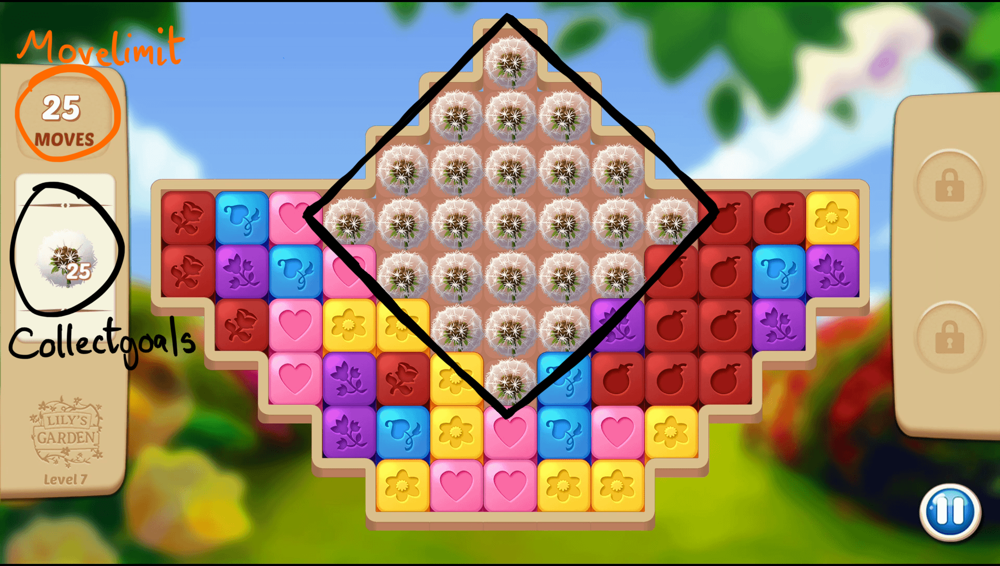

# Puzzle Game Mechanics

The gameplay in <a href="https://apps.apple.com/dk/app/lilys-garden-design-relax/id1437783446">Lily's Garden</a> is a blast-type puzzle game, where the main gameplay objective is to collect all objectives in a level within a given movelimit.
An example of how a typical level looks like is shown below:

Here, the objective is to collect the 25 dandelion within 25 moves. In order to collect items, the player must attack said board pieces by either tapping on an adjacent cluster (2+) of same color basic pieces or use power pieces.

Later in the game, power pieces must be used to complete the goal. Power pieces, which will be described in more detail later, are created by matching 5+ basic pieces, as shown below where a bomb power piece is created:

# Board pieces

## Basic pieces

Basic pieces can be destroyed by tapping on a cluster of at least two. By tapping 5 or more, different power pieces can be created:

Number | Power piece created
--- | ---
5-7|Vertical/horizontal rocket
8-9|Bomb
10+|Flask

## Power pieces

Power pieces can be combined to create more powerful effects. Below is shown what happens when a flask and rocket is combined:

Power piece | Area attacked | Description
--- | --- | ---
Rocket|13 x 1 \| 1 x 9|Attacks whole row/column.
Bomb|3 x 5 + 5 x 3|Attacks in a circle around bomb.
Flask|*n*|Attacks all *n* basic pieces of one color on the board.
Rocket + rocket|13 x 1 + 1 x 9|Attacks whole row AND column, regardless of previous rocket direction.
Rocket + bomb|13 x 3 \| 9 x 3|Instead of only attacking a single row/column, attacks 3 whole rows/columns.
Bomb + bomb|7 x 7|Bigger explosion.
Flask + rocket/bomb|\~All|Replaces all same color basic tiles with random rocket/bomb. Typically enough to win level.
Flask + flask|13 x 9|Attacks the whole board.

## Other board pieces

<table>
<thead>
  <tr>
    <th>Image</th>
    <th>Name [tutorial level]</th>
    <th>Game Id</th>
    <th><a href="http://localhost:3000/environment">Channels</a></th>
    <th>Additional information</th>

  </tr>
</thead>

<tr>
<td> </td>
  <td>Dandelion (1hp) [26]</td>
  <td>PopCorn</td>
  <td>8, 15, 21, 22</td>
  <td> Blocker with gravity. </td>
</tr>

<tr>
 <td> </td>
   <td>Seedbag (1hp) [21]</td>
   <td>Milk</td>
   <td>8, 15</td>
   <td> Get to bottom of map to collect it. </td>
</tr>

<tr>
  <td> </td>
    <td>Box of Seedbags (1hp) [27]</td>
    <td>MegaDrop</td>
    <td>8, 15</td>
    <td> 2x2 piece, get to bottom of map to collect it. </td>
</tr>

<tr>
 <td> </td>
   <td>Water Drop (1hp) [14]</td>
   <td>Bubble</td>
   <td>8, 20</td>
   <td> Clear piece underneath it to collect it. </td>
</tr>

<tr>
  <td> </td>
    <td>Bubble dispenser (1hp)</td>
    <td>BubbleDispenser3x3</td>
    <td>15, 18, 21</td>
    <td> Spawns bubble in a circle around it. </td>
</tr>

<tr>
  <td> </td>
    <td>Rocks (1-5hp) [41]</td>
    <td>Rock</td>
    <td>8, 21, 22</td>
    <td> Static blocker without gravity. </td>
</tr>

<tr>
 <td> </td>
   <td>Flower Bee (1hp) [9]</td>
   <td>EndlessCollectorPiece</td>
   <td>8, 18, 21, 22</td>
   <td> Does not disappear from map but spawns collectgoals when hit. </td>
</tr>

<tr>
  <td> </td>
    <td>Colored Potted Plant (1-3hp) [16]</td>
    <td>ColoredBlockerWithGravity</td>
    <td>1-6, 8, 15, 21, 22</td>
    <td> Match with same color to collect it. </td>
</tr>

<tr>
  <td> </td>
    <td>Chestnut (2hp) [50]</td>
    <td>BlockerWithGravity2Hp</td>
    <td>8, 15, 21, 22</td>
    <td> Like dandelion but with 2hp. </td>
</tr>  

<tr>
  <td> </td>
    <td>Weeds (1hp) [5]</td>
    <td>SpreadingBlocker</td>
    <td>8, 15, 21, 22</td>
    <td> Spreads to nearest basic piece if not attacked in previous round. </td>
</tr>  

<tr>
  <td> </td>
    <td>Mushroom (1hp) [46]</td>
    <td>ColoredBlocker</td>
    <td>1-6, 8, 21, 22</td>
    <td> Static blocker with color, match same color to collect. </td>
</tr>  

<tr>
  <td> </td>
    <td>Snail Shell (1hp) [22]</td>
    <td>HardBlocker</td>
    <td>8, 15, 22</td>
    <td> Only possible to remove with power pieces. </td>
</tr>

<tr>
  <td> </td>
    <td>Bird net (1hp) [17]</td>
    <td>Cage</td>
    <td>8, 21, 22</td>
    <td> Covers a board piece, attack with same kind of piece to remove it. </td>
</tr>

<tr>
  <td> </td>
    <td>Bush With Lights (1-10hp) [10]</td>
    <td>MegaBlocker MegaBlockerPiece</td>
    <td>8, 21, 22</td>
    <td> 2x2 static blocker with up to 10hp. </td>
</tr>

<tr>
  <td>
  </td>
    <td>Teleport [28]</td>
    <td>-</td>
    <td> No good way to represent it, basically leads to random board state. </td>
</tr>

<tr>
  <td> </td>
    <td>Butterfly (1+1hp) [8]</td>
    <td>BlockerWithGravityColorable</td>
    <td>1-6, 8, 15, 19, 21, 22</td>
    <td> First takes on color of first attack, then becomes a standard colored blocker with 1hp.  </td>
</tr>

<tr>
  <td> </td>
    <td>Garden Gnomes (1-10hp) [7]</td>
    <td>MegaMultiColoredBlocker</td>
    <td>1-6, 8, 21, 22</td>
    <td> 2x2 colored blocker with up to ten pieces in the box. </td>
</tr>

<tr>
  <td> </td>
    <td>Sunflower (3hp) [43]</td>
    <td>LayerCake</td>
    <td>8, 15, 21, 22</td>
    <td> Blocker with gravity and 3hp. </td>
</tr>
</table>
